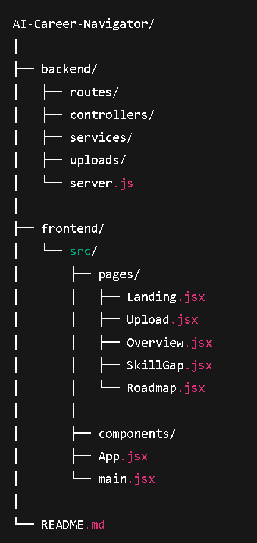

  

  

  

  

  

SkillGap AI is an AI-powered career guidance platform that helps users understand their current skill level, compare themselves against target roles, identify skill gaps, and receive a clear, actionable, week-by-week learning roadmap.
Unlike generic career advice tools, this system focuses on personalization, explainability, and practical outcomes.

<h1>🚀 Project Motivation </h1>

Many students and early professionals face career confusion due to:
Lack of clarity on where they stand
Overwhelming and generic learning advice
No structured path from “current state” to “target role”
AI Career Navigator solves this by acting as a career companion, not just a chatbot.

<h1>🎯 What This Application Does</h1>

The platform allows users to:
Upload their resume
Select a target career role (e.g., SDE, AI/ML, DevOps, DSA-focused)
Automatically analyze their resume
Compare current skills with industry expectations
Identify: Strong skills ,Skills needing improvement, Missing skills, Generate a personalized learning roadmap with Weekly goals,Topics to study, Free learning resources, Mini-project / hands-on tasks

<h1>🧠 Core Features </h1>
1️⃣ Resume Analysis

Upload resume (PDF/Text) , Extract: Technical skills, Tools & technologies, Experience level, Project exposure, Generate a structured profile summary

<h1>2️⃣ Target Role Selection </h1>

Predefined industry-aligned roles:

Software Development Engineer (SDE)
AI / Machine Learning Engineer
DevOps Engineer
DSA-focused roles
Each role is mapped to a structured skill framework.

<h1>3️⃣ Skill Gap Analysis </h1>

Compares resume skills with role requirements and categorizes them into:

✅ Strong Skills
⚠️ Needs Improvement
❌ Missing Skills
Skills are prioritized based on entry-level industry relevance.

<h1> 4️⃣ Personalized Learning Roadmap </h1>

Generates a week-by-week roadmap that includes:
Topics to learn, Learning methods (videos, reading, practice), Curated free resources, Mini-project or hands-on tasks, Focused on clarity and practicality, not motivation fluff.

<h1>5️⃣ Clean, Explainable UI </h1>
Career Overview page
Skill Gap visualization
Interactive learning roadmap (accordion-based)
Clear navigation and progress flow

🧩 System Design Principles

Combines rule-based logic with LLM reasoning
Structured and explainable AI outputs
Avoids hallucinated or vague suggestions
Modular, scalable architecture
Easy to explain in technical interviews

🛠️ Tech Stack
Frontend
React.js, React Router, Tailwind CSS, LocalStorage (state persistence)
Backend
Node.js, Express.js, Multer (resume upload handling), PDF/Text parsing, REST APIs

AI Layer
LLM-based reasoning for:
Skill extraction, Gap analysis, Roadmap generation, Rule-based validation for accuracy

📂 Project Structure

  

🔄 Application Flow
User lands on the landing page
Uploads resume
Selects target role
Backend analyzes resume
Career overview is generated
Skill gap is displayed
Personalized learning roadmap is shown

🎯 Success Criteria
The project is successful if:
Users clearly understand where they stand
Users know exactly what to do next
The roadmap feels achievable and structured
The system can be confidently explained in interviews

🚀 Future Enhancements
(Not part of MVP)
Job readiness score
Progress tracking  milestones
Community dashboard
Resume re-upload comparison
Export roadmap as PDF
Authentication & history

