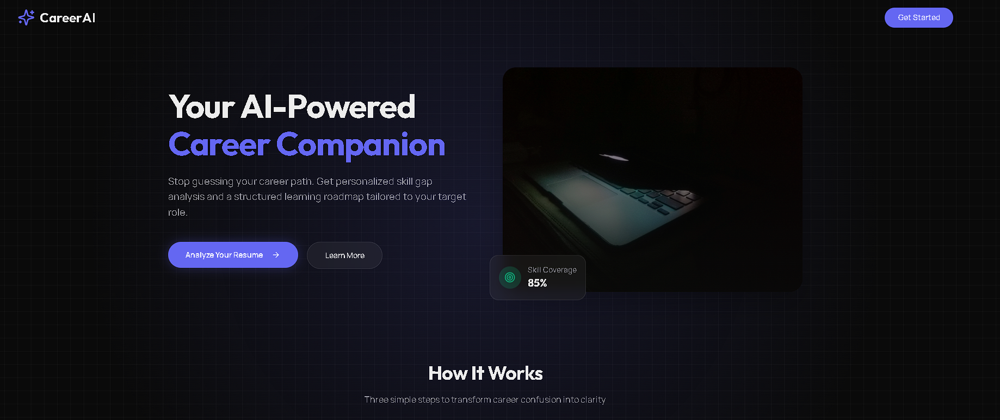
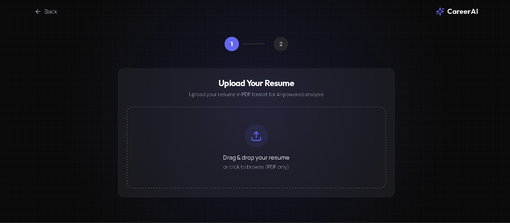
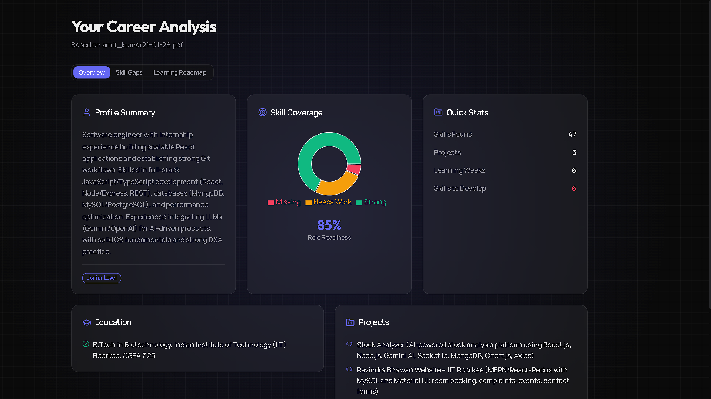
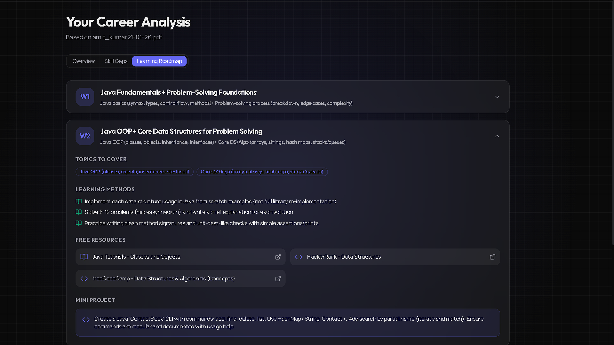
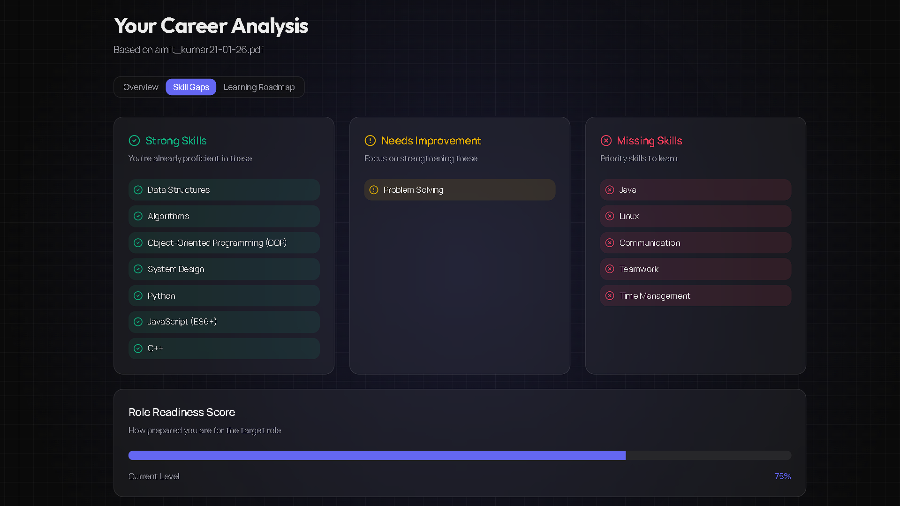

### 🚀 SkillGap AI – Career Guidance & Skill Gap Analyzer

<p align="center">
  
</p>
<p align="center">
  
</p>
<p align="center">
  
</p>
<p align="center">
  
</p>
<p align="center">
  
</p>

### **Overview**

**SkillGap AI** is an AI-powered career guidance platform that helps users understand their current skill level, compare themselves against target roles, identify skill gaps, and receive a clear, actionable, week-by-week learning roadmap.

Unlike generic career advice tools, this system focuses on **personalization**, **explainability**, and **practical outcomes**.

---

## 🌐 Live Demo

**🔗 [Try the Live Application](https://stock-analyst-chat-gpt.vercel.app/)**

Experience the full functionality of the SkillBridge AI  with our live deployment. Test the AI-powered carrer analysis, week by week roadmap, and strenght and weakness and your jon readiness score .

### **🚀 Project Motivation**

Many students and early professionals face career confusion due to:
- Lack of clarity on where they stand
- Overwhelming and generic learning advice
- No structured path from **current state** to **target role**

**SkillGap AI** solves this by acting as a **career companion**, not just a chatbot.

---

### **🎯 What This Application Does**

The platform allows users to:
- Upload their resume
- Select a target career role (e.g., SDE, AI/ML, DevOps, DSA-focused)
- Automatically analyze their resume
- Compare current skills with industry expectations
- Identify:
  - **Strong skills**
  - **Skills needing improvement**
  - **Missing skills**
- Generate a **personalized learning roadmap** including:
  - Weekly goals
  - Topics to study
  - Free learning resources
  - Mini-projects / hands-on tasks

---

### **🧠 Core Features**

### **1️⃣ Resume Analysis**

- Upload resume (PDF / Text)
- Extract:
  - Technical skills
  - Tools & technologies
  - Experience level
  - Project exposure
- Generate a structured profile summary

---

### **2️⃣ Target Role Selection**

Predefined industry-aligned roles:
- Software Development Engineer (SDE)
- AI / Machine Learning Engineer
- DevOps Engineer
- DSA-focused roles

Each role is mapped to a **structured skill framework**.

---

### **3️⃣ Skill Gap Analysis**

Compares resume skills with role requirements and categorizes them into:
- **Strong Skills**
- **Needs Improvement**
- **Missing Skills**

Skills are prioritized based on **entry-level industry relevance**.

---

### **4️⃣ Personalized Learning Roadmap**

Generates a week-by-week roadmap that includes:
- Topics to learn
- Learning methods (videos, reading, practice)
- Curated free resources
- Mini-projects / hands-on tasks

Focused on **clarity and practicality**, not motivation fluff.

---

### **5️⃣ Clean, Explainable UI**

- Career overview page
- Skill gap visualization
- Interactive learning roadmap (accordion-based)
- Clear navigation and progress flow

---

### **🧩 System Design Principles**

- Combines rule-based logic with LLM reasoning
- Structured and explainable AI outputs
- Avoids hallucinated or vague suggestions
- Modular, scalable architecture
- Easy to explain in technical interviews

---

### **🛠️ Tech Stack**

### **Frontend**
- React.js
- React Router
- Tailwind CSS
- LocalStorage (state persistence)

### **Backend**
- Node.js
- Express.js
- Multer (resume upload handling)
- PDF / Text parsing
- REST APIs

### **AI Layer**

LLM-based reasoning for:
- Skill extraction
- Gap analysis
- Roadmap generation
- Rule-based validation for accuracy

---

### **📁 Project Structure**

```text
AI-Career-Navigator/
│
├── backend/
│   ├── routes/
│   ├── controllers/
│   ├── services/
│   ├── uploads/
│   └── server.js
│
├── frontend/
│   └── src/
│       ├── pages/
│       │   ├── Landing.jsx
│       │   ├── Upload.jsx
│       │   ├── Overview.jsx
│       │   ├── SkillGap.jsx
│       │   └── Roadmap.jsx
│       │
│       ├── components/
│       ├── App.jsx
│       └── main.jsx
│
└── README.md
```

### ⚙️ Installation & Setup

### **Prerequisites**

- Node.js 18+
- MongoDB
- OpenAI API Key (or Emergent LLM Key)

---

### **Backend Setup**

```bash
cd backend
npm install

MONGO_URL=mongodb://localhost:27017
DB_NAME=careerai
CORS_ORIGINS=*
OPENAI_API_KEY=your-api-key

npm run dev
```
### **Frontend Setup**
```bash
cd frontend
npm install

REACT_APP_BACKEND_URL=http://localhost:5000

npm start
```
### 🔄 Application Flow

- User lands on the landing page
- Uploads resume
- Selects target role
- Backend analyzes resume
- Career overview is generated
- Skill gap is displayed
- Personalized learning roadmap is shown

---

### 🎯 Success Criteria

The project is successful if:

- Users clearly understand where they stand
- Users know exactly what to do next
- The roadmap feels achievable and structured
- The system can be confidently explained in interviews

---

### 🚀 Future Enhancements

- Job readiness score
- Progress tracking & milestones
- Community dashboard
- Resume re-upload comparison
- Export roadmap as PDF
- Authentication & history

---

<p align="center">
  Built with ❤️ 
</p>

---


